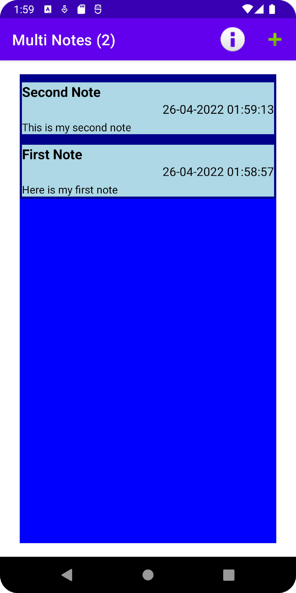
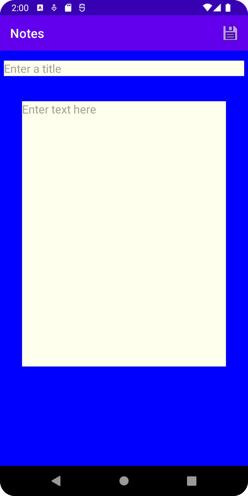

# Notes

This is a basic app that serves the sole purpose of writing and storing notes. Once a new note is created it is saved to a json file. This allows the note to be reloaded 
on future runs of the application. Notes are time stamped and sorted based on that order. Each note can be edited and deleted. 

   
